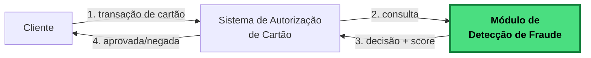

# Rinha de Backend 2026 – Detecção de Fraude por Busca Vetorial!

## Sobre esta edição

O desafio é construir uma **API de detecção de fraude em autorizações de cartão**. Sua API recebe uma transação, transforma-a em um vetor e usa **busca vetorial** contra um dataset de referência com transações já classificadas como fraudulentas ou legítimas para decidir se a transação deve ser aprovada ou negada junto com um score de fraude.



O módulo destacado em verde é **o que você vai construir**.


## O Básico do desafio

1. A API recebe um `POST /fraud-score` com os dados da transação.
1. Normaliza os campos em um vetor de 14 dimensões (valores entre `0.0` e `1.0`).
1. Faz uma **busca vetorial** no dataset de referência.
1. Pega os `K=5` vizinhos mais próximos e faz votação por maioria.
1. Retorna `{ approved, fraud_score }`, por exemplo:
   ```json
   { "approved": false, "fraud_score": 0.8 }
   ```

**A arquitetura e restrições** é o clássico da Rinha de Backend: um load balancer com duas ou mais APIs e o perrengue de sempre com quase nada de CPU e memória – [confira aqui](./ARQUITETURA_E_RESTICOES.md).

---

## O que mais você precisa saber / Próximos passos

1. **[BUSCA_VETORIAL.md](./BUSCA_VETORIAL.md)** — O que é busca vetorial, normalização e KNN, com exemplo passo-a-passo.
   *Essencial se você nunca trabalhou com vetores ou KNN.*

1. **[DATASET.md](./DATASET.md)** — Formato dos arquivos de referência (`references.json`, `mcc_risk.json`, `normalization.json`) e as 14 dimensões do vetor.
   *Para entender como transformar o payload em vetor.*

1. **[API.md](./API.md)** — Contrato dos endpoints (`POST /fraud-score`, `GET /ready`), formato do payload e da resposta.
   *Essencial — é o que sua submissão precisa implementar.*

1. **[ARQUITETURA_E_RESTICOES.md](./ARQUITETURA_E_RESTICOES.md)** — Limites de CPU/memória, docker-compose, nginx, portas, stateless.
   *Antes de montar o container de submissão.*

1. **[AVALIACAO.md](./AVALIACAO.md)** — Fórmula de pontuação, peso de FP/FN, multiplicador de latência, como rodar o teste local.
   *Para otimizar sua pontuação.*

1. **[SUBMISSAO.md](./SUBMISSAO.md)** — Passo-a-passo do PR, checklist e data limite.
   *Quando estiver pronto para submeter.*

1. **[FAQ.md](./FAQ.md)** — Dúvidas recorrentes, armadilhas comuns, o que pode e não pode.

---

Para o sumário geral, volte ao [README principal](../../README.md).
